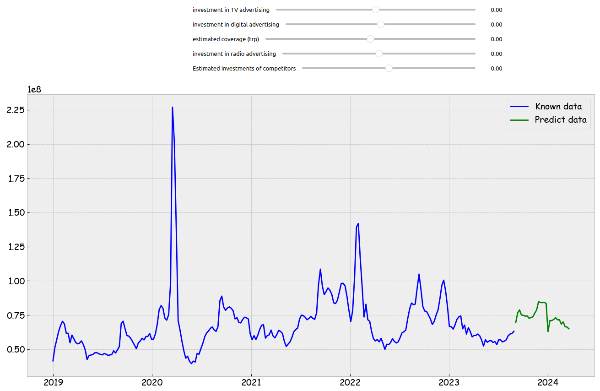

Решаемые задачи:  
- Прогнозирование продаж на будущий период исходя из ретроспективных данных по всем факторам, а также по данным медиа показателей бренда!  
- Оценка эконометрических параметров (влияние рекламы, сезонности и конкурентов на продажи)
Для решения предлагается использование методов градиентого бустинга с целью построения прогнозирующей модели. Эконометрические параметры оцениваются через веса модели

analysis.ipynb -- блокнот с аналитикой признаков. (Построение матрицы кореляции, оценка зависимости параметров и др...)  
optuna_hyperparams.ipynb -- оптимизация catboost модели по параметрам с использованием optuna  
stacking.ipynb -- стэкинг catboost моделей для улучшения метрики  
prod.ipynb -- визуализация результатов выхода модели  
vi.ipynb - пробный интерфейс  
data -- эксель данные для обучения  
catboost_info -- catboost модель

# Использование 
Сначало необходимо установить зависимости
```piip install -r requriments.txt```

Далее возможно через Jupiter Notebook загрузить данные в формате `.csv` или `.xlxs` и получить предсказания.

Пример выхода:




